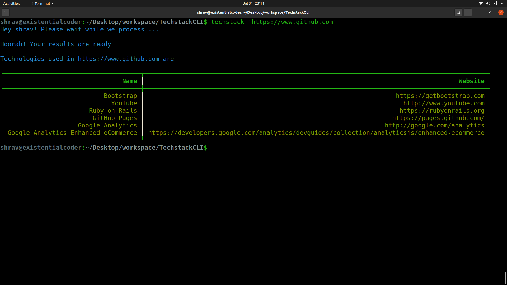
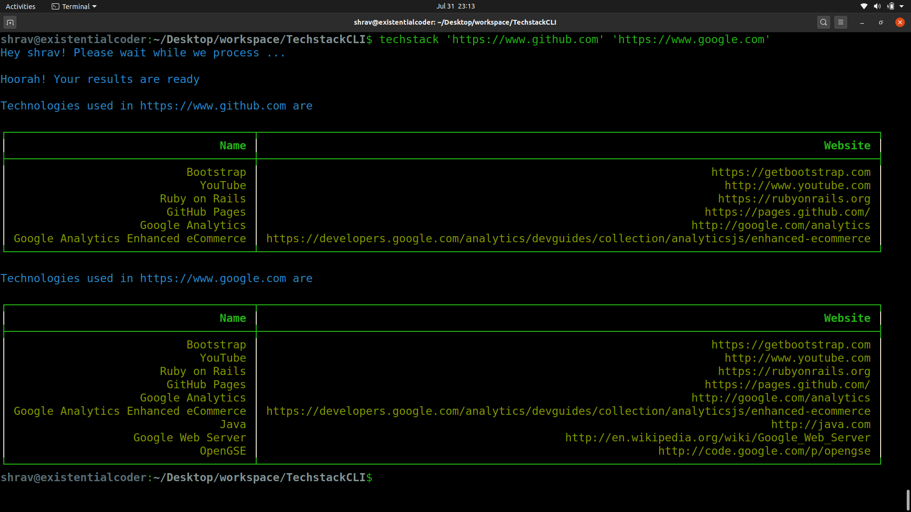

# Techstack CLI

#### CLI app to reveal tech stack of an enterprise (CLI wrapper for [Wappalyzer](https://www.npmjs.com/package/wappalyzer))

#### Steps to use

- Download ```node```
- Run the following command on terminal
```sh
npm install -g techstack-cli
source ~/.bashrc
techstack 'https://www.netflix.com'
```
#### Examples
Try for a single url
```sh
techstack 'https://www.github.com'
```

Or more than one url (<b>upto 10</b>)


Feel free to contribute. Happy hacking :)
